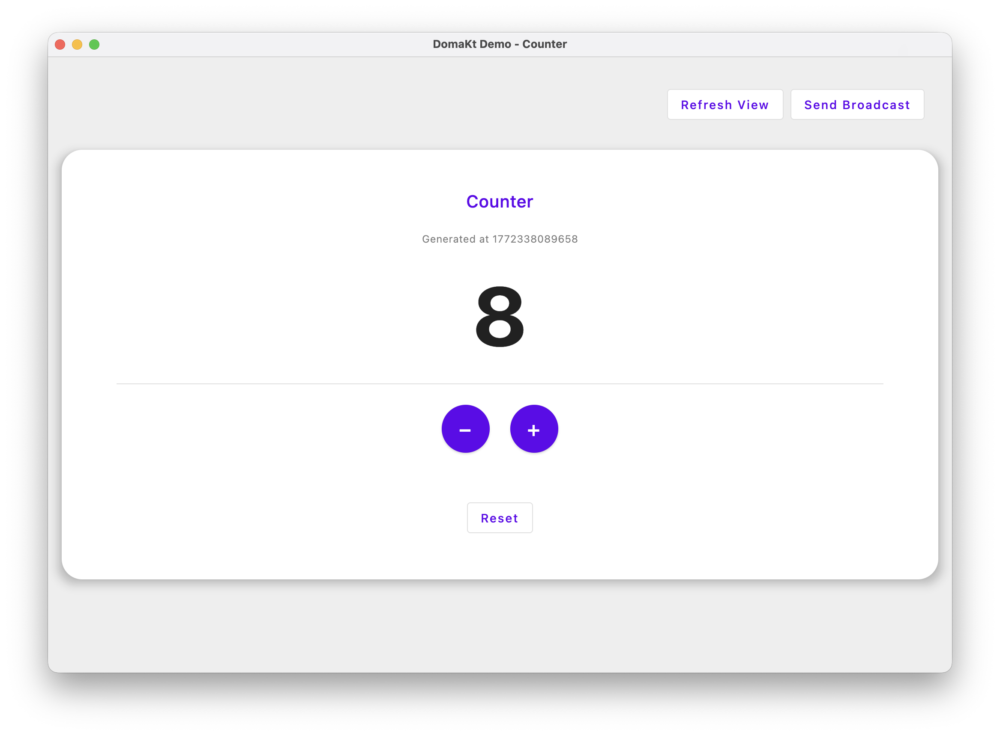

# PulseMVI

[](http://kotlinlang.org)
[](https://www.jetbrains.com/lp/compose-multiplatform/)
[](https://opensource.org/licenses/Apache-2.0)
[](https://jitpack.io/#kaleidot725/PulseMVI)

A lightweight MVI library for **Compose Desktop**.
Designed for Desktop's multi-Composable layouts, PulseMVI adds **Broadcast** to notify all Stores simultaneously and **View Refresh** to reconstruct the view tree on demand.



## Features

- 🏗️ **MVI Architecture** - Clear separation of State, Action, Event, and Broadcast
- 🔄 **Store & Container** - Store manages state autonomously; Container coordinates multiple Stores
- 📡 **Broadcast** - Type-safe messages delivered from Container to all registered Stores simultaneously
- 🖥️ **View Refresh** - Forces the view tree to reconstruct on demand while preserving Store state
- ⚡ **Coroutine-Based** - Built on Kotlin Coroutines and StateFlow
- 🎨 **Compose Integration** - Ready-to-use Composable helpers with automatic lifecycle management

## Requirements

- Java 17 or higher
- Kotlin 2.0 or higher
- Compose Multiplatform project

## Installation

### JitPack (Recommended)

Add the JitPack repository to your build configuration:

#### Gradle (Kotlin DSL)

```kotlin
repositories {
    maven { url = uri("https://jitpack.io") }
}

dependencies {
    implementation("com.github.kaleidot725:PulseMVI:Tag")
}
```

#### Gradle (Groovy)

```groovy
repositories {
    maven { url 'https://jitpack.io' }
}

dependencies {
    implementation 'com.github.kaleidot725:PulseMVI:Tag'
}
```

#### Maven

```xml
<repositories>
    <repository>
        <id>jitpack.io</id>
        <url>https://jitpack.io</url>
    </repository>
</repositories>

<dependency>
    <groupId>com.github.kaleidot725</groupId>
    <artifactId>PulseMVI</artifactId>
    <version>Tag</version>
</dependency>
```

> **Note**: Replace `Tag` with the desired version tag (e.g., `v1.0.0`) or a specific commit hash.

## Architecture

PulseMVI provides two complementary components:

- **PulseStore** — Manages UI state for a specific screen component. Handles user actions directly and reacts to broadcasts from the Container.
- **PulseContainer** — Coordinates multiple Stores. Delivers typed `PulseBroadcast` messages to all registered Stores, and can trigger a view refresh.

```
User Action
    │
    ▼
PulseStore.onAction()
    │
    └── update { ... } ──▶ UI re-renders

PulseContainer.broadcast(broadcast)      ← Notify all Stores simultaneously
    │
    └── PulseStore.onReceive(broadcast) ──▶ update { ... } ──▶ UI re-renders

PulseContainer.refresh()                 ← Reconstruct the view tree
    │
    └── View reconstructs (Store state is preserved)
```

## Quick Start

### 1. Define State, Action, Event, and Broadcast

```kotlin
// State: the UI state managed by Store
data class CounterState(val count: Int = 0) : PulseState

// Action: user intents dispatched directly to Store
sealed class CounterAction : PulseAction {
    data object Increment : CounterAction()
    data object Decrement : CounterAction()
    data object Reset : CounterAction()
}

// Event: one-time side effects emitted from Store
sealed class CounterEvent : PulseEvent {
    data class ShowMessage(val message: String) : CounterEvent()
}

// Broadcast: messages delivered from Container to all Stores
sealed class CounterBroadcast : PulseBroadcast {
    data object Refresh : CounterBroadcast()
}
```

### 2. Create a Store

`PulseStore` manages its own UI state and handles user actions. Override `onSetup` to initialize subscriptions, `onAction` to handle user intents, and `onReceive` to react to broadcasts.

```kotlin
class CounterStore(
    private val repository: CounterRepository,
) : PulseStore<CounterState, CounterAction, CounterEvent, CounterBroadcast>(
    initialUiState = CounterState(),
) {
    override fun onSetup() {
        coroutineScope.launch {
            repository.count.collect { count ->
                update { copy(count = count) }
                if (count != 0 && count % 10 == 0) {
                    event(CounterEvent.ShowMessage("$count reached!"))
                }
            }
        }
    }

    override fun onAction(uiAction: CounterAction) {
        coroutineScope.launch {
            when (uiAction) {
                CounterAction.Increment -> repository.increment()
                CounterAction.Decrement -> repository.decrement()
                CounterAction.Reset -> repository.reset()
            }
        }
    }

    override fun onReceive(broadcast: CounterBroadcast) {
        when (broadcast) {
            is CounterBroadcast.Refresh -> event(CounterEvent.ShowMessage("Refreshed!"))
        }
    }
}
```

### 3. Create a Container

`PulseContainer` coordinates multiple Stores. Use `broadcast` to send a typed message to all registered Stores, and `refresh` to reconstruct the view.

```kotlin
class CounterContainer(
    stores: List<PulseStore<*, *, *, CounterBroadcast>>,
) : PulseContainer<CounterBroadcast>(stores = stores)
```

### 4. Connect to Compose UI

Instantiate stores in the entry point, then use `PulseApp` for layout and `PulseContent` inside it to observe each Store. `PulseContent` automatically responds to `refresh()` when nested inside `PulseApp`.

**Entry point** — create stores once and pass them down:

```kotlin
fun main() = application {
    val repository = remember { CounterRepository() }
    val store = remember { CounterStore(repository) }
    val container = remember { CounterContainer(stores = listOf(store)) }

    Window(onCloseRequest = ::exitApplication, title = "Counter") {
        MaterialTheme {
            CounterApp(container = container, store = store)
        }
    }
}
```

**App composable** — wrap with `PulseApp` and expose refresh/broadcast controls:

```kotlin
@Composable
fun CounterApp(container: CounterContainer, store: CounterStore) {
    PulseApp(container = container) { onRefresh, onBroadcast ->
        Box(modifier = Modifier.fillMaxSize().padding(16.dp)) {
            Row(modifier = Modifier.align(Alignment.TopEnd)) {
                Button(onClick = { onRefresh() }) { Text("Refresh View") }
                Button(onClick = { onBroadcast(CounterBroadcast.Refresh) }) { Text("Send Broadcast") }
            }
            CounterContent(store = store, modifier = Modifier.align(Alignment.Center))
        }
    }
}
```

**Content composable** — use `PulseContent` to observe a Store and handle events:

```kotlin
@Composable
fun CounterContent(store: CounterStore) {
    val scope = rememberCoroutineScope()
    val snackbarHostState = remember { SnackbarHostState() }

    Box {
        PulseContent(
            store = store,
            onEvent = { event ->
                when (event) {
                    is CounterEvent.ShowMessage -> scope.launch { snackbarHostState.showSnackbar(event.message) }
                }
            },
        ) { state, onAction ->
            Column(horizontalAlignment = Alignment.CenterHorizontally) {
                Text(text = "${state.count}", fontSize = 72.sp)
                Row {
                    Button(onClick = { onAction(CounterAction.Decrement) }) { Text("−") }
                    Button(onClick = { onAction(CounterAction.Increment) }) { Text("+") }
                }
                OutlinedButton(onClick = { onAction(CounterAction.Reset) }) { Text("Reset") }
            }
        }
        SnackbarHost(hostState = snackbarHostState, modifier = Modifier.align(Alignment.BottomCenter))
    }
}
```

## API Reference

### PulseStore

Base class for managing UI state within a specific screen component.

| Member | Description |
|---|---|
| `state: StateFlow<UiState>` | The current UI state as a StateFlow |
| `currentState: UiState` | Snapshot of the current UI state |
| `event: Flow<Event>` | Stream of one-time side effects |
| `coroutineScope` | CoroutineScope tied to the Store's lifecycle |
| `onSetup()` | Called when the Store is first subscribed to |
| `onAction(uiAction)` | Called when a user action is dispatched |
| `onReceive(broadcast)` | Called when the Container broadcasts a message |
| `update { }` | Updates the UI state |
| `event(effect)` | Emits a one-time side effect |
| `cancel()` | Cancels the coroutine scope and prepares the Store for reuse |

### PulseContainer

Base class for coordinating multiple Stores.

| Member | Description |
|---|---|
| `broadcast(broadcast)` | Delivers a broadcast message to all registered Stores |
| `refresh()` | Reconstructs the view while preserving Store state |

### Composable Helpers

#### PulseApp

Manages a `PulseContainer` and provides `onRefresh` and `onBroadcast` callbacks to the content block. `PulseContent` placed inside automatically responds to `refresh()`.

```kotlin
PulseApp(container = myContainer) { onRefresh, onBroadcast ->
    // Compose UI
    PulseContent(store = myStore) { state, onAction ->
        // Compose UI
    }
}
```

#### PulseContent

Observes a `PulseStore` and provides state and action dispatcher to the content block. Automatically cancels the Store's coroutine scope when removed from composition.

```kotlin
PulseContent(
    store = myStore,
    onEvent = { event -> /* handle side effects */ },
) { state, onAction ->
    // Compose UI
}
```

### PulseBroadcast

Marker interface for type-safe messages delivered from `PulseContainer` to all registered `PulseStore` instances.

```kotlin
sealed class MyBroadcast : PulseBroadcast {
    data object Refresh : MyBroadcast()
    data class DataChanged(val value: Int) : MyBroadcast()
}
```

## Example Application

See the [`demo`](demo/) module for a complete counter application demonstrating Store, Container, and Broadcast in action.

Run the demo:

```bash
./gradlew :demo:run
```

## Building

Build the library:

```bash
./gradlew build
```

Run tests:

```bash
./gradlew test
```

Publish to local Maven:

```bash
./gradlew :library:publishToMavenLocal
```

## License

```
Copyright 2026 kaleidot725

Licensed under the Apache License, Version 2.0 (the "License");
you may not use this file except in compliance with the License.
You may obtain a copy of the License at

    http://www.apache.org/licenses/LICENSE-2.0

Unless required by applicable law or agreed to in writing, software
distributed under the License is distributed on an "AS IS" BASIS,
WITHOUT WARRANTIES OR CONDITIONS OF ANY KIND, either express or implied.
See the License for the specific language governing permissions and
limitations under the License.
```
