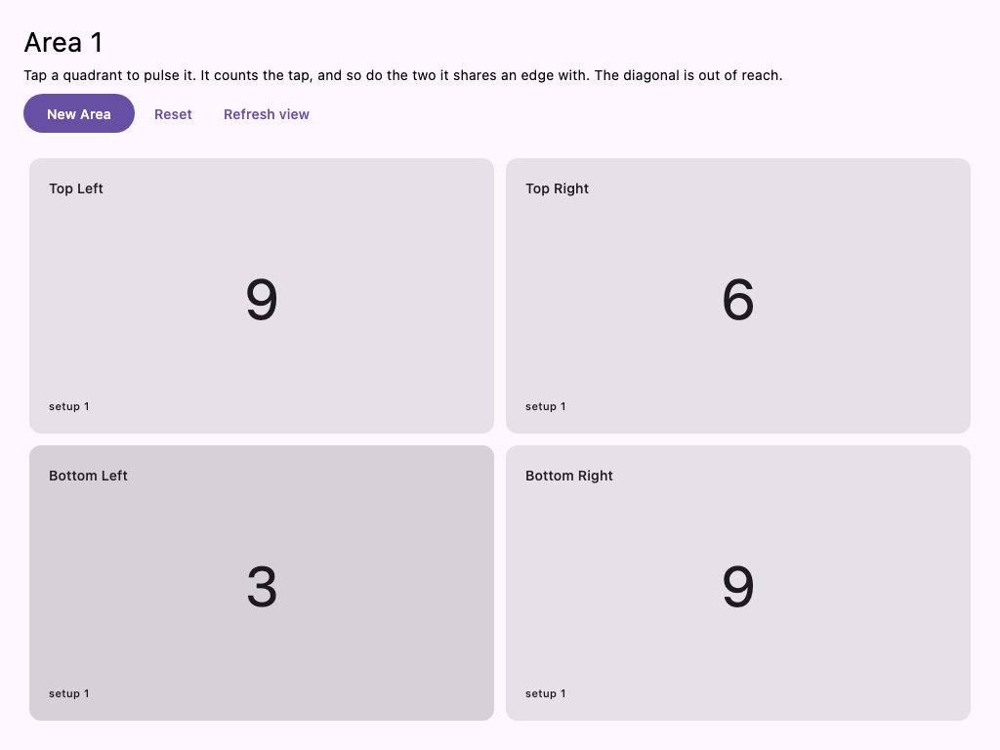

# PulseMVI

[](http://kotlinlang.org)
[](https://www.jetbrains.com/lp/compose-multiplatform/)
[](https://opensource.org/licenses/Apache-2.0)
[](https://jitpack.io/#kaleidot725/PulseMVI)

A lightweight MVI library for **Compose Multiplatform** on Android, iOS, and Desktop.
PulseMVI adds **Broadcast** to notify all Stores simultaneously, **Unicast** to send child Store messages up to the Container, and **View Refresh** to reconstruct the view tree on demand.



## Features

- 🏗️ **MVI Architecture** - Clear separation of State, Action, Event, Broadcast, and Unicast
- 🔄 **Store & Container** - Store manages state autonomously; Container coordinates multiple Stores
- 📡 **Broadcast** - Type-safe messages delivered from Container to all registered Stores simultaneously
- ⬆️ **Unicast** - Optional messages emitted from child Stores to the Container
- 🖥️ **View Refresh** - Forces the view tree to reconstruct on demand while preserving Store state
- ⚡ **Coroutine-Based** - Built on Kotlin Coroutines and StateFlow
- 🎨 **Compose Integration** - Ready-to-use Composable helpers with automatic lifecycle management

## Requirements

- Java 17 or higher
- Kotlin 2.0 or higher
- Compose Multiplatform project
- Android API 21 or higher, iOS, or JVM Desktop

## Installation

### JitPack (Recommended)

Add the JitPack repository to your build configuration:

#### Gradle (Kotlin DSL)

```kotlin
repositories {
    maven { url = uri("https://jitpack.io") }
}

dependencies {
    implementation("com.github.kaleidot725:pulsemvi:Tag")

    // Optional: ViewModel owned Store lifetimes and Navigation 3 back stack scoping
    implementation("com.github.kaleidot725:pulsemvi-navigation3:Tag")
}
```

#### Gradle (Groovy)

```groovy
repositories {
    maven { url 'https://jitpack.io' }
}

dependencies {
    implementation 'com.github.kaleidot725:pulsemvi:Tag'

    // Optional: ViewModel owned Store lifetimes and Navigation 3 back stack scoping
    implementation 'com.github.kaleidot725:pulsemvi-navigation3:Tag'
}
```

#### Maven

```xml
<repositories>
    <repository>
        <id>jitpack.io</id>
        <url>https://jitpack.io</url>
    </repository>
</repositories>

<dependency>
    <groupId>com.github.kaleidot725</groupId>
    <artifactId>pulsemvi</artifactId>
    <version>Tag</version>
</dependency>

<!-- Optional: ViewModel owned Store lifetimes and Navigation 3 back stack scoping -->
<dependency>
    <groupId>com.github.kaleidot725</groupId>
    <artifactId>pulsemvi-navigation3</artifactId>
    <version>Tag</version>
</dependency>
```

> **Note**: Replace `Tag` with the desired version tag (e.g., `v1.0.0`) or a specific commit hash.

### Artifacts

| Artifact | Contents |
|---|---|
| `pulsemvi` | `PulseState`, `PulseAction`, `PulseEvent`, `PulseBroadcast`, `PulseUnicast`, `PulseStore`, `PulseContainer`, `PulseHost`, `PulseContent`. Depends on the Compose runtime and coroutines only |
| `pulsemvi-navigation3` | `rememberPulseStore`, `rememberPulseContainer` and `rememberPulseNavEntryDecorators`. Adds `androidx.lifecycle` and Navigation 3 |

`pulsemvi` publishes `iosX64` (the Intel simulator); `pulsemvi-navigation3` does not, because
`navigation3-ui` has no such variant. Drop `iosX64()` from your targets, or keep the core artifact
alone there.

The core artifact leaves the Store lifetime to you: call `onSetup()` when the Store becomes active
and `cancel()` when it is done. In a composition that is one `DisposableEffect`:

```kotlin
val store = remember { CounterStore(repository) }
DisposableEffect(store) {
    store.onSetup()
    onDispose { store.cancel() }
}

PulseContent(store = store) { state, onAction ->
    // Compose UI
}
```

The Store then lives exactly as long as this composition, so leaving and re-entering it repeats
`onSetup()`, and an Android configuration change starts over. Add `pulsemvi-navigation3` when the
Store should outlive the composition — its `rememberPulseStore` hands the lifetime to a `ViewModel`
scoped to the host, or to a Navigation 3 back stack entry.

## Architecture

PulseMVI provides two complementary components:

- **PulseStore** — Manages UI state for a specific screen component. Handles user actions directly, reacts to broadcasts from the Container, and can emit `PulseUnicast` messages up to the Container.
- **PulseContainer** — Coordinates multiple Stores. Delivers typed `PulseBroadcast` messages to all registered Stores, receives child unicasts, and can trigger a view refresh.

```
User Action
    │
    ▼
PulseStore.onAction()
    │
    └── update { ... } ──▶ UI re-renders

PulseContainer.broadcast(broadcast)      ← Notify all Stores simultaneously
    │
    └── PulseStore.onReceive(broadcast) ──▶ update { ... } ──▶ UI re-renders

PulseStore.unicast(unicast)          ← Notify parent Container
    │
    └── PulseContainer.onReceived(unicast) ──▶ broadcast(...) / refresh(...) / app logic

PulseContainer.refresh()                 ← Reconstruct the view tree
    │
    └── View reconstructs (Store state is preserved)
```

## Quick Start

### 1. Define State, Action, Event, Broadcast, and Unicast

```kotlin
// State: the UI state managed by Store
data class CounterState(val count: Int = 0) : PulseState

// Action: user intents dispatched directly to Store
sealed class CounterAction : PulseAction {
    data object Increment : CounterAction()
    data object Decrement : CounterAction()
    data object Reset : CounterAction()
}

// Event: one-time side effects emitted from Store
sealed class CounterEvent : PulseEvent {
    data class ShowMessage(val message: String) : CounterEvent()
}

// Broadcast: messages delivered from Container to all Stores
sealed class CounterBroadcast : PulseBroadcast {
    data object Refresh : CounterBroadcast()
    data object ResetNotified : CounterBroadcast()
}

// Unicast: messages emitted from child Store to Container
sealed interface CounterUnicast : PulseUnicast {
    data object ResetRequested : CounterUnicast
}
```

### 2. Create a Store

`PulseStore` manages its own UI state and handles user actions. Override `onSetup` to initialize subscriptions, `onAction` to handle user intents, and `onReceive` to react to broadcasts.

Both `PulseStore` and `PulseContainer` accept an optional `coroutineDispatcher` constructor argument. It defaults to `Dispatchers.Default`; mobile apps can pass `Dispatchers.Main`, and tests can pass a test dispatcher.

```kotlin
class CounterStore(
    private val repository: CounterRepository,
) : PulseStore<CounterState, CounterAction, CounterEvent, CounterBroadcast, CounterUnicast>(
    initialUiState = CounterState(),
) {
    override fun onSetup() {
        coroutineScope.launch {
            repository.count.collect { count ->
                update { copy(count = count) }
                if (count != 0 && count % 10 == 0) {
                    event(CounterEvent.ShowMessage("$count reached!"))
                }
            }
        }
    }

    override fun onAction(uiAction: CounterAction) {
        coroutineScope.launch {
            when (uiAction) {
                CounterAction.Increment -> repository.increment()
                CounterAction.Decrement -> repository.decrement()
                CounterAction.Reset -> {
                    repository.reset()
                    unicast(CounterUnicast.ResetRequested)
                }
            }
        }
    }

    override fun onReceive(broadcast: CounterBroadcast) {
        when (broadcast) {
            is CounterBroadcast.Refresh -> event(CounterEvent.ShowMessage("Refreshed!"))
            is CounterBroadcast.ResetNotified -> event(CounterEvent.ShowMessage("Parent received reset"))
        }
    }
}
```

### 3. Create a Container

`PulseContainer` coordinates multiple Stores. Use `broadcast` to send a typed message to all registered Stores, and `refresh` to reconstruct the view.

```kotlin
class CounterContainer(
    stores: List<PulseStore<*, *, *, CounterBroadcast, CounterUnicast>>,
) : PulseContainer<CounterBroadcast, CounterUnicast>(stores = stores) {
    override fun onReceived(unicast: CounterUnicast) {
        when (unicast) {
            CounterUnicast.ResetRequested -> broadcast(CounterBroadcast.ResetNotified)
        }
    }
}
```

### 4. Connect to Compose UI

Instantiate stores in the entry point, then use `PulseHost` for layout and `PulseContent` inside it to observe each Store. `PulseContent` automatically responds to `refresh()` when nested inside `PulseHost`.

**Entry point** — create stores once and pass them down:

```kotlin
fun main() = application {
    Window(onCloseRequest = ::exitApplication, title = "Counter") {
        MaterialTheme {
            val store = rememberPulseStore { CounterStore(CounterRepository()) }
            val container = rememberPulseContainer { CounterContainer(stores = listOf(store)) }

            CounterScreen(container = container, store = store)
        }
    }
}
```

On Android the same composables go inside `ComponentActivity.setContent { }`. `rememberPulseStore`
picks up the Activity's `ViewModelStoreOwner`, so rotation keeps the Store, its state, and its
running `onSetup()` work.

**Screen composable** — wrap with `PulseHost` and expose refresh/broadcast controls:

```kotlin
@Composable
fun CounterScreen(container: CounterContainer, store: CounterStore) {
    PulseHost(container = container) { onRefresh, onBroadcast ->
        Box(modifier = Modifier.fillMaxSize().padding(16.dp)) {
            Row(modifier = Modifier.align(Alignment.TopEnd)) {
                Button(onClick = { onRefresh() }) { Text("Refresh View") }
                Button(onClick = { onBroadcast(CounterBroadcast.Refresh) }) { Text("Send Broadcast") }
            }
            CounterContent(store = store, modifier = Modifier.align(Alignment.Center))
        }
    }
}
```

**Content composable** — use `PulseContent` to observe a Store and handle events:

```kotlin
@Composable
fun CounterContent(store: CounterStore) {
    val scope = rememberCoroutineScope()
    val snackbarHostState = remember { SnackbarHostState() }

    Box {
        PulseContent(
            store = store,
            onEvent = { event ->
                when (event) {
                    is CounterEvent.ShowMessage -> scope.launch { snackbarHostState.showSnackbar(event.message) }
                }
            },
        ) { state, onAction ->
            Column(horizontalAlignment = Alignment.CenterHorizontally) {
                Text(text = "${state.count}", fontSize = 72.sp)
                Row {
                    Button(onClick = { onAction(CounterAction.Decrement) }) { Text("−") }
                    Button(onClick = { onAction(CounterAction.Increment) }) { Text("+") }
                }
                OutlinedButton(onClick = { onAction(CounterAction.Reset) }) { Text("Reset") }
            }
        }
        SnackbarHost(hostState = snackbarHostState, modifier = Modifier.align(Alignment.BottomCenter))
    }
}
```

## API Reference

### PulseStore

Base class for managing UI state within a specific screen component.

| Member | Description |
|---|---|
| `state: StateFlow<UiState>` | The current UI state as a StateFlow |
| `currentState: UiState` | Snapshot of the current UI state |
| `event: Flow<Event>` | Stream of one-time side effects |
| `coroutineScope` | CoroutineScope tied to the Store's lifecycle |
| `onSetup()` | Called once by whoever owns the Store's lifetime; `PulseContent` never calls it |
| `onAction(uiAction)` | Called when a user action is dispatched |
| `onReceive(broadcast)` | Called when the Container broadcasts a message |
| `unicast(unicast)` | Emits a child-to-parent message |
| `update { }` | Updates the UI state |
| `event(effect)` | Emits a one-time side effect |
| `cancel()` | Cancels the coroutine scope and prepares the Store for reuse |

### PulseContainer

Base class for coordinating multiple Stores.

| Member | Description |
|---|---|
| `broadcast(broadcast)` | Delivers a broadcast message to all registered Stores |
| `onReceived(unicast)` | Called when a child Store emits an unicast |
| `refresh()` | Reconstructs the view while preserving Store state |

### Composable Helpers

#### rememberPulseStore / rememberPulseContainer

Creates a Store or a Container that survives configuration changes. Both are owned by a `ViewModel`
scoped to the current `ViewModelStoreOwner`, so an Android configuration change (rotation, theme
switch, ...) rebuilds the composition without rebuilding them: state is preserved and `onSetup()` is
not repeated. The Store scope is cancelled, and `PulseContainer.close()` is called, only once the
owner is cleared.

```kotlin
@Composable
fun CounterScreen() {
    val store = rememberPulseStore { CounterStore(CounterRepository()) }
    val container = rememberPulseContainer { CounterContainer(stores = listOf(store)) }

    PulseHost(container = container) { _, _ ->
        PulseContent(store = store) { state, onAction ->
            // Compose UI
        }
    }
}
```

The key defaults to the class name. Pass an explicit `key` when the same type is used more than once
under a single owner:

```kotlin
val left = rememberPulseStore(key = "left") { CounterStore(leftRepository) }
val right = rememberPulseStore(key = "right") { CounterStore(rightRepository) }
```

Internally both read `LocalViewModelStoreOwner.current` and keep a `ViewModel` in that owner's
`ViewModelStore`. **Whatever owner is in scope at the call site decides how long the Store lives**,
so anything that changes that owner changes the lifetime:

- Under the host owner, the Store lives as long as the screen
- Under a Navigation 3 entry — pass `rememberPulseNavEntryDecorators()` as `NavDisplay`'s
  `entryDecorators` and create the Store inside the destination — it lives as long as the route stays
  on the back stack, and is cancelled when the route is popped
- Under an owner you provide with `CompositionLocalProvider(LocalViewModelStoreOwner provides ...)`,
  it lives as long as you keep that owner

Nothing removes a Store from its owner before the owner is cleared, so creating Stores under a long
lived owner accumulates them. Scope them to a narrower owner when a screen creates Stores it will not
need again.

Android (`ComponentActivity`), iOS (`ComposeUIViewController`) and Desktop (`Window`) all provide a
`ViewModelStoreOwner`. Embedding Compose somewhere that does not means nothing owns a lifetime, and
`rememberPulseStore` says so rather than inventing an owner: provide one with
`CompositionLocalProvider(LocalViewModelStoreOwner provides owner)`, or use the core artifact alone
and drive the lifecycle yourself.

iOS and Desktop have no configuration change, so nothing rebuilds the composition behind your back
there and the Store simply lives as long as its host: on iOS the owner is cleared when the
`ComposeUIViewController` is destroyed. The same code works on all three platforms, so there is no
platform specific entry point to write.

> **Note**: `rememberPulseStore` does not restore state after process death. Use `rememberSaveable`
> for anything that has to outlive the process.

#### PulseHost

Manages a `PulseContainer` and provides `onRefresh` and `onBroadcast` callbacks to the content block. `PulseContent` placed inside automatically responds to `refresh()`.

```kotlin
PulseHost(container = myContainer) { onRefresh, onBroadcast ->
    // Compose UI
    PulseContent(store = myStore) { state, onAction ->
        // Compose UI
    }
}
```

#### PulseContent

Observes a `PulseStore` and provides state and action dispatcher to the content block.

`PulseContent` only observes — it never starts or cancels the Store. The setup lifecycle belongs to `rememberPulseStore`: `onSetup()` runs once when the Store is created, and the scope is cancelled when the owning `ViewModelStoreOwner` is cleared. Leaving composition, including another Navigation 3 destination covering the route, therefore never repeats setup or loses Store state.

With `rememberPulseNavEntryDecorators()` as `NavDisplay`'s `entryDecorators`, each destination gets its own owner, so a Store created inside a destination lives exactly as long as its route stays on the back stack.

```kotlin
PulseContent(
    store = myStore,
    onEvent = { event -> /* handle side effects */ },
) { state, onAction ->
    // Compose UI
}
```

### PulseBroadcast

Marker interface for type-safe messages delivered from `PulseContainer` to all registered `PulseStore` instances.

```kotlin
sealed class MyBroadcast : PulseBroadcast {
    data object Refresh : MyBroadcast()
    data class DataChanged(val value: Int) : MyBroadcast()
}
```

### PulseUnicast

Marker interface for type-safe messages emitted from a child `PulseStore` to its parent `PulseContainer`.

```kotlin
sealed interface MyUnicast : PulseUnicast {
    data object SaveRequested : MyUnicast
}
```

## Example Application

See the [`demo`](demo/) module for an Android, iOS, and Desktop Compose Multiplatform application
using Navigation 3, and [`iosApp`](iosApp/) for the Xcode project that hosts it on iOS. It shows
Store setup, per destination lifetimes, and state preservation across configuration changes on
screen.

Run the Desktop demo:

```bash
./gradlew :demo:run
```

Run the Android demo:

```bash
./gradlew :demo:installDebug
```

Run the iOS demo by opening `iosApp/iosApp.xcodeproj` in Xcode and running the `iosApp` scheme on a
simulator. The Xcode target builds the Kotlin framework itself through
`:demo:embedAndSignAppleFrameworkForXcode`, so no separate Gradle step is needed. From the command
line:

```bash
xcodebuild -project iosApp/iosApp.xcodeproj -scheme iosApp \
  -destination 'platform=iOS Simulator,name=iPhone 17 Pro' test
```

That runs `iosAppUITests`, which drives the real app on a simulator: it rotates the device and
asserts the counter value, the navigation position, and that `onSetup()` is not repeated.

The demo shows this lifecycle:

1. Opening Counter creates the Store through `rememberPulseStore` and runs `onSetup()` once. The
   screen shows the call count.
2. Opening Count details keeps the Store alive, so returning does not repeat setup.
3. Rotating the device rebuilds the composition on Android, but not the Store: the count, the back
   stack, and the setup counter all stay put. iOS has no configuration change, so nothing is
   rebuilt there in the first place.
4. The Store scope is cancelled, and the Container closed, only when the host's `ViewModelStore` is
   cleared.

## Building

Build the library:

```bash
./gradlew build
```

Run tests:

```bash
./gradlew test
```

Publish to local Maven:

```bash
./gradlew :library:publishToMavenLocal :navigation3:publishToMavenLocal
```

## License

```
Copyright 2026 kaleidot725

Licensed under the Apache License, Version 2.0 (the "License");
you may not use this file except in compliance with the License.
You may obtain a copy of the License at

    http://www.apache.org/licenses/LICENSE-2.0

Unless required by applicable law or agreed to in writing, software
distributed under the License is distributed on an "AS IS" BASIS,
WITHOUT WARRANTIES OR CONDITIONS OF ANY KIND, either express or implied.
See the License for the specific language governing permissions and
limitations under the License.
```
