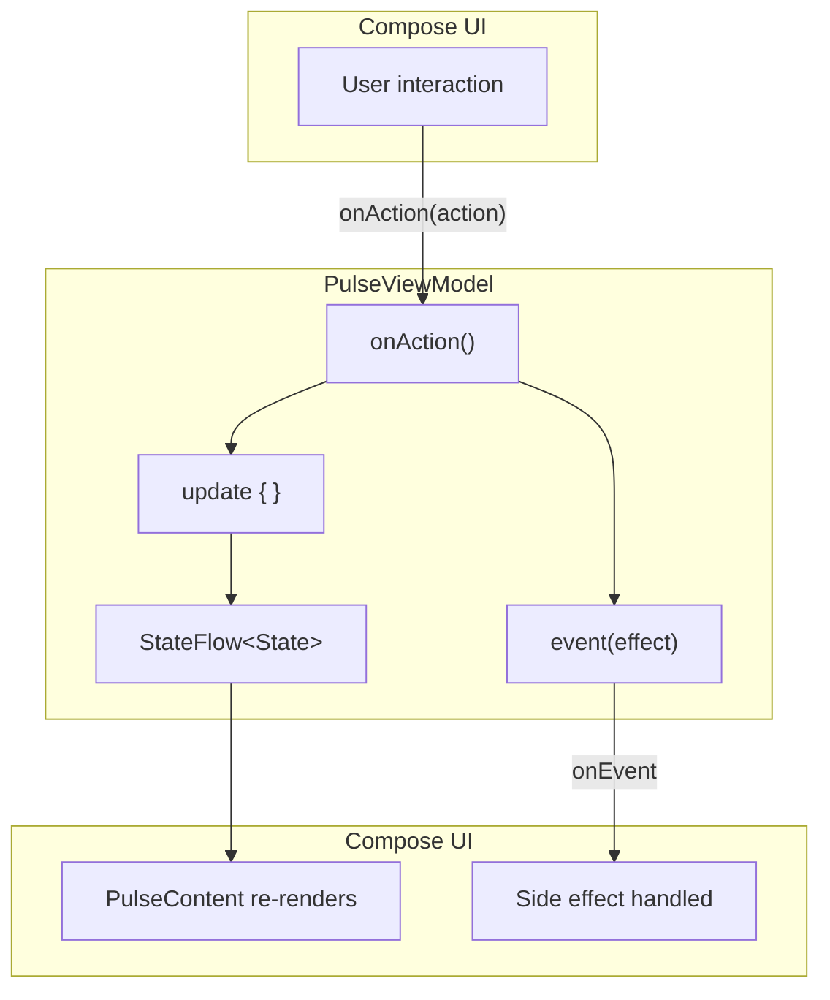
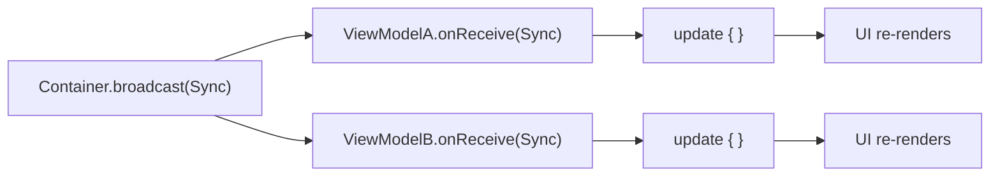
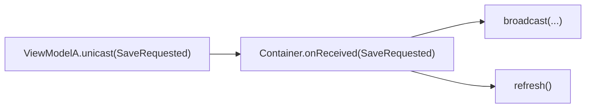
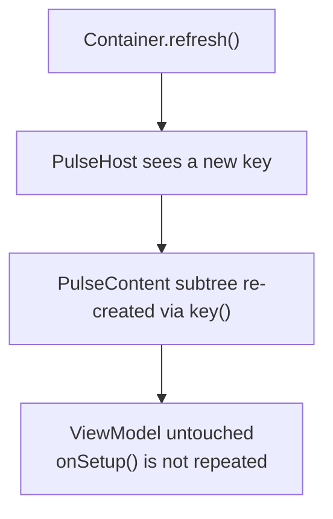
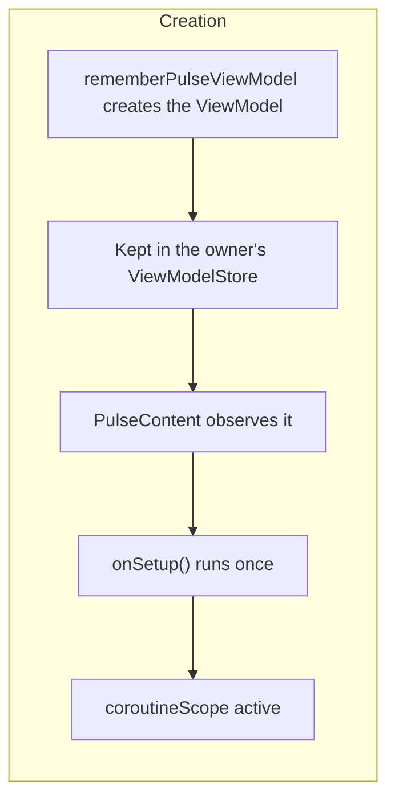
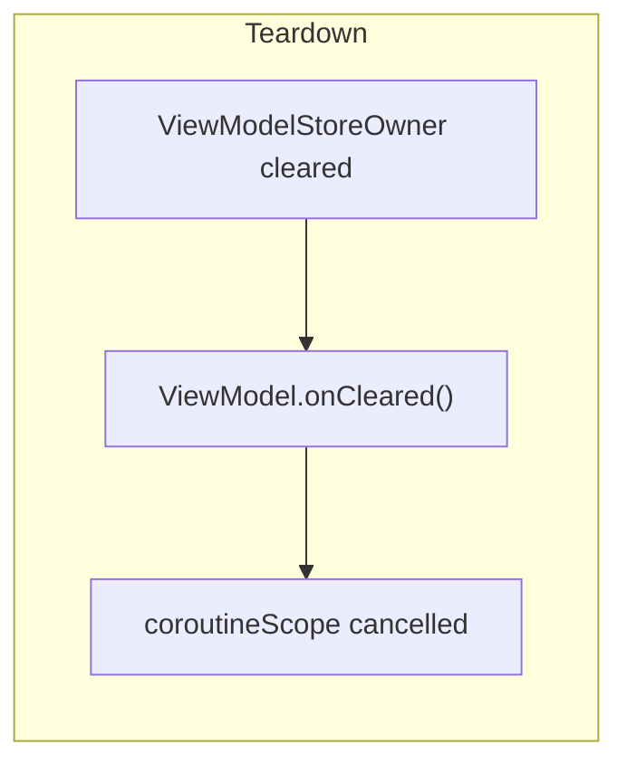

# Architecture

PulseMVI follows the MVI (Model-View-Intent) pattern and adds three coordination primitives: **Broadcast**, **Unicast**, and **View Refresh**.

## Data Flow

## Broadcast Flow

When multiple ViewModels need to react to the same event, use `PulseContainer.broadcast()`:

## Unicast Flow

When a child ViewModel needs to notify its parent Container, use `PulseViewModel.unicast()`:

## View Refresh Flow

`Container.refresh()` forces the Compose view tree to reconstruct. ViewModel states are **preserved** — only the Composables are re-created:

## Component Responsibilities

| Component | Responsibility |
|---|---|
| `PulseState` | Immutable snapshot of UI data |
| `PulseAction` | User intent — what the user wants to do |
| `PulseEvent` | One-time side effect — navigation, dialog, snackbar |
| `PulseBroadcast` | Cross-ViewModel notification from Container |
| `PulseUnicast` | Child-to-parent notification from ViewModel |
| `PulseViewModel` | Owns state; handles actions and broadcasts; can emit unicasts |
| `PulseContainer` | Coordinates ViewModels; enables broadcast, unicast handling, and refresh |
| `PulseHost` | Compose wrapper that propagates container key |
| `PulseContent` | Compose wrapper that observes a ViewModel |

## Lifecycle

::: tip
`onSetup()` runs once when `PulseContent` first observes the ViewModel, and the ViewModel stays active for as long as its `ViewModelStoreOwner` lives. A composition restart never repeats setup, and neither does `refresh()`.

Which owner that is decides the ViewModel's lifetime. Creating the ViewModel under the host owner keeps it alive for the whole screen. Creating it inside a Navigation 3 destination, with `rememberPulseNavEntryDecorators()` as the `NavDisplay` decorators, scopes it to that back stack entry: covering the route with another destination keeps the ViewModel, popping the route cancels it. The demo builds every destination that way.
:::

