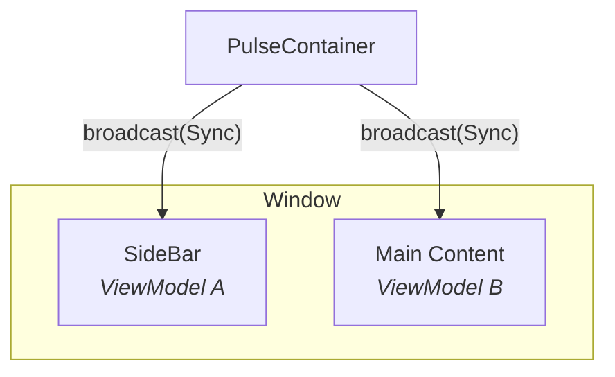

# What is PulseMVI?

PulseMVI is a lightweight MVI (Model-View-Intent) library for **Compose Desktop**. It extends the standard MVI pattern with three coordination features for multi-Composable layouts:

- **Broadcast** — deliver a typed message from a Container to all registered ViewModels at once
- **Unicast** — send a typed message from a child ViewModel up to its Container
- **View Refresh** — reconstruct the entire Compose view tree on demand without losing ViewModel state

## Why PulseMVI?

Compose apps often contain multiple independent Composable sections, each with its own state. PulseMVI makes it easy to coordinate these sections without tightly coupling them. In the layout below, `PulseContainer` sits above both ViewModels: when you call `container.broadcast(MyBroadcast.Sync)`, both ViewModel A and ViewModel B receive the message and can react independently.



## Installation

### Repository

Add JitPack to `settings.gradle.kts`.

```kotlin
// settings.gradle.kts
dependencyResolutionManagement {
    repositories {
        maven { url = uri("https://jitpack.io") }
    }
}
```

### Dependencies

Add the dependencies to `build.gradle.kts`, replacing `<version>` with the latest tag from
[GitHub Releases](https://github.com/kaleidot725/PulseMVI/releases). `pulsemvi` alone leaves the
ViewModel lifetime to you (see [ViewModel](/guide/viewmodel)); add `pulsemvi-navigation3` to scope it
to a back stack entry instead (see [Navigation 3](/guide/navigation3)).

```kotlin
// build.gradle.kts
dependencies {
    implementation("com.github.kaleidot725:pulsemvi:<version>")

    // Optional: owner scoped lifetimes and Navigation 3 back stack scoping
    implementation("com.github.kaleidot725:pulsemvi-navigation3:<version>")
}
```

## Artifacts

| Artifact | Contents |
|---|---|
| `pulsemvi` | `PulseState`, `PulseAction`, `PulseEvent`, `PulseBroadcast`, `PulseUnicast`, `PulseViewModel`, `PulseContainer`, `PulseHost`, `PulseContent` |
| `pulsemvi-navigation3` | `rememberPulseViewModel`, `rememberPulseContainer`, `rememberPulseNavEntryDecorators` |

## Requirements

| Requirement | Version |
|---|---|
| Java | 17+ |
| Kotlin | 2.0+ |
| Compose Multiplatform | 1.6+ |

## Next Steps

- [Getting Started](/guide/getting-started) — build your first counter app
- [Architecture](/guide/architecture) — understand how all the pieces fit together
- [Navigation 3](/guide/navigation3) — scope ViewModels to a back stack entry
- [Unicast](/guide/unicast) — send child ViewModel messages up to a Container
