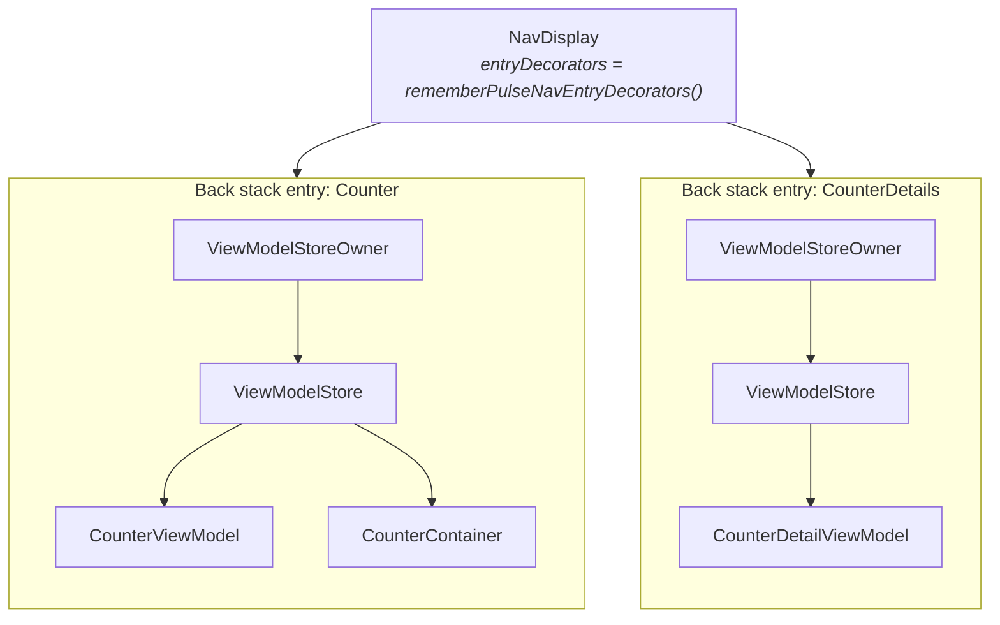

# Navigation 3

`pulsemvi-navigation3` is an optional artifact. It ties a `PulseViewModel`'s lifetime to a
Navigation 3 back stack entry. The core artifact has no opinion about lifetime. `PulseViewModel`
extends `androidx.lifecycle.ViewModel`, so whichever `ViewModelStore` holds an instance decides how
long it lives. This artifact supplies two things: a store per back stack entry, and the composables
that put a ViewModel into it. The wiring itself is in
[Getting Started, step 5](/guide/getting-started#_5-scope-the-viewmodel-to-a-navigation-3-destination).
This page explains what that wiring does.

## What the artifact adds

Three composables, and nothing else. The core artifact stays free of Navigation 3 and the lifecycle
compose dependencies.

| Composable | Role |
|---|---|
| `rememberPulseViewModel` | Creates a `PulseViewModel` in the `ViewModelStore` of the owner in scope, or returns the one already there |
| `rememberPulseContainer` | The same for a `PulseContainer` |
| `rememberPulseNavEntryDecorators` | The `NavEntryDecorator` list that makes each `NavDisplay` entry an owner |

## How an owner is found

`rememberPulseViewModel` reads `LocalViewModelStoreOwner.current`. It keeps the instance in that
owner's `ViewModelStore`, under a key. It never creates an owner of its own. So whatever owner is in
scope at the call site decides the lifetime. Under a plain Compose Desktop `Window`, that owner is
the window. The ViewModel lives as long as the screen. Under a `NavDisplay` decorated with
`rememberPulseNavEntryDecorators()`, each entry on the back stack carries its own owner. A ViewModel
created inside a destination goes into that entry's store. It follows that nothing may be created
above `NavDisplay` if it is meant to belong to a route. A ViewModel created outside the destinations
lands in the window's store. It outlives every route.



## Why both decorators

`NavDisplay` takes a list of `NavEntryDecorator`s. It defaults to the saveable state holder alone,
which is what keeps `rememberSaveable` state across the back stack. Scoping ViewModels needs a
second decorator: `rememberViewModelStoreNavEntryDecorator()` from
`lifecycle-viewmodel-navigation3`. Passing only that one, though, would silently drop saveable
state. `rememberPulseNavEntryDecorators()` returns both, in the order `NavDisplay` expects. Making
that mistake hard to make is part of why the artifact exists.

## Lifetime along the back stack

The store belongs to the entry. So the ViewModel follows the route, not the composition. Covering
the route with another destination removes its composable. It does not remove its entry. The
instance and its running coroutines are untouched. Coming back finds the same instance. `PulseContent`
does not repeat `onSetup()`. Popping the route clears the entry's store. That calls `onCleared()` on
everything in it.

| Route | ViewModel |
|---|---|
| Pushed | Created; `PulseContent` runs `onSetup()` once |
| Covered by another destination | Kept, with its state and coroutines |
| Returned to | The same instance; `onSetup()` is not repeated |
| Popped | The entry's `ViewModelStore` is cleared: `onCleared()` cancels the scope and closes the Container |
| Composition restarted under a surviving owner | Reused; state stands |

## Keys

The key defaults to the ViewModel's qualified class name. A key is unique per owner, not globally.
Two instances of one type under a single owner therefore collide. Give them explicit keys. The demo's
four areas are the same class four times over, so it does this for all four.

```kotlin
val left = rememberPulseViewModel(key = "left") { CounterViewModel(leftRepository) }
val right = rememberPulseViewModel(key = "right") { CounterViewModel(rightRepository) }
```

## Without Navigation 3

You do not have to use this artifact. `PulseViewModel` extends `androidx.lifecycle.ViewModel`. So
`viewModel()` and `koinViewModel()` build one just as well. `PulseContent` runs `onSetup()` whichever
way it was built. What changes is teardown. `close()` runs from `onCleared()`, and only a
`ViewModelStore` calls that. See [Driving the lifecycle yourself](/guide/viewmodel#driving-the-lifecycle-yourself).

## Next Steps

- [Getting Started](/guide/getting-started#_5-scope-the-viewmodel-to-a-navigation-3-destination) — the wiring, step by step
- [Navigation 3 API](/api/navigation3) — the full signatures and owner resolution rules
- [ViewModel](/guide/viewmodel) — lifecycle hooks and state updates
