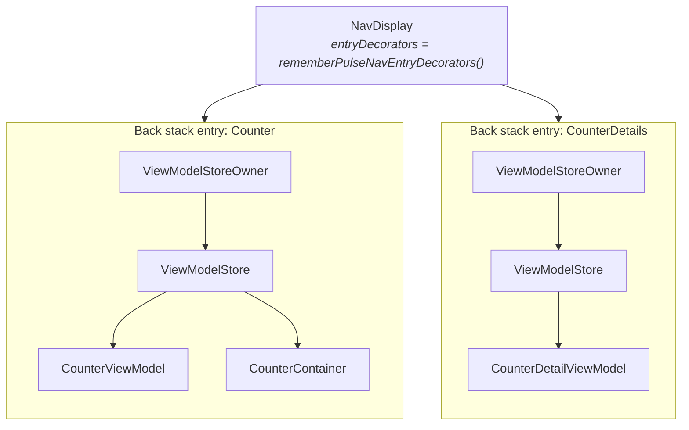

# Navigation 3

`pulsemvi-navigation3` is an optional artifact. It ties a `PulseViewModel`'s lifetime to a
Navigation 3 back stack entry.

The core artifact has no opinion about lifetime. `PulseViewModel` is an
`androidx.lifecycle.ViewModel`, so whichever `ViewModelStore` holds it decides how long it lives.
This artifact supplies a store per back stack entry, and the composables that put a ViewModel into
it.

The wiring itself is in
[Getting Started, step 5](/guide/getting-started#_5-scope-the-viewmodel-to-a-navigation-3-destination).
This page explains what that wiring does.

## What the artifact adds

Three composables, and nothing else. The core does not depend on Navigation 3 or
lifecycle-compose.

| Composable | Role |
|---|---|
| `rememberPulseViewModel` | Creates a `PulseViewModel` in the `ViewModelStore` of the owner in scope, or returns the one already there |
| `rememberPulseContainer` | The same for a `PulseContainer` |
| `rememberPulseNavEntryDecorators` | The `NavEntryDecorator` list that makes each `NavDisplay` entry an owner |

## How an owner is found

`rememberPulseViewModel` reads `LocalViewModelStoreOwner.current` and keeps the instance in that
owner's `ViewModelStore`. It never creates an owner of its own. Whatever owner is in scope at the
call site decides the lifetime.

Where you call it changes which owner that is.

- **Directly under `Window`** — the owner is the window. The ViewModel lives as long as the screen
- **Inside a `NavDisplay` destination** — with `rememberPulseNavEntryDecorators()` passed to
  `NavDisplay`, each back stack entry carries its own owner. The ViewModel goes into that entry's
  store

It follows that nothing meant to belong to a route may be created above `NavDisplay`. A ViewModel
created outside the destinations lands in the window's store and outlives every route.



## Why both decorators

`NavDisplay` defaults `entryDecorators` to a single decorator, the saveable state holder. That is
what keeps `rememberSaveable` state across the back stack.

Scoping ViewModels to an entry needs a second one: `rememberViewModelStoreNavEntryDecorator()` from
`lifecycle-viewmodel-navigation3`. Passing only that one, though, replaces the default, and
saveable state is silently lost.

`rememberPulseNavEntryDecorators()` returns both, in the order `NavDisplay` expects. Making that
mistake hard to make is part of why the artifact exists.

## Lifetime along the back stack

The store belongs to the entry, so the ViewModel follows the route rather than the composition.

| Route | ViewModel |
|---|---|
| Pushed | Created; `PulseContent` runs `onSetup()` once |
| Covered by another destination | The composable goes, the entry stays. State and running coroutines are kept |
| Returned to | The same instance is found; `onSetup()` is not repeated |
| Popped | The entry's `ViewModelStore` is cleared: `onCleared()` cancels the scope and closes the Container |
| Composition restarted under a surviving owner | Reused; state stands |

## Keys

The key defaults to the ViewModel's qualified class name. A key is unique per owner, so two
instances of one type under a single owner collide. Give them explicit keys. The demo's four areas
are the same class, so all four carry a key.

```kotlin
val left = rememberPulseViewModel(key = "left") { CounterViewModel(leftRepository) }
val right = rememberPulseViewModel(key = "right") { CounterViewModel(rightRepository) }
```

## Without Navigation 3

This artifact is not required. `PulseViewModel` is an `androidx.lifecycle.ViewModel`, so
`viewModel()` and `koinViewModel()` build one just as well. `PulseContent` runs `onSetup()`
whichever way it was built.

What changes is teardown. `close()` is called by `onCleared()`, and only a `ViewModelStore` calls
that. For holding one without a store, see
[Driving the lifecycle yourself](/guide/viewmodel#driving-the-lifecycle-yourself).

## Next Steps

- [Getting Started](/guide/getting-started#_5-scope-the-viewmodel-to-a-navigation-3-destination) — the wiring, step by step
- [Navigation 3 API](/api/navigation3) — the full signatures and owner resolution rules
- [ViewModel](/guide/viewmodel) — lifecycle hooks and state updates
