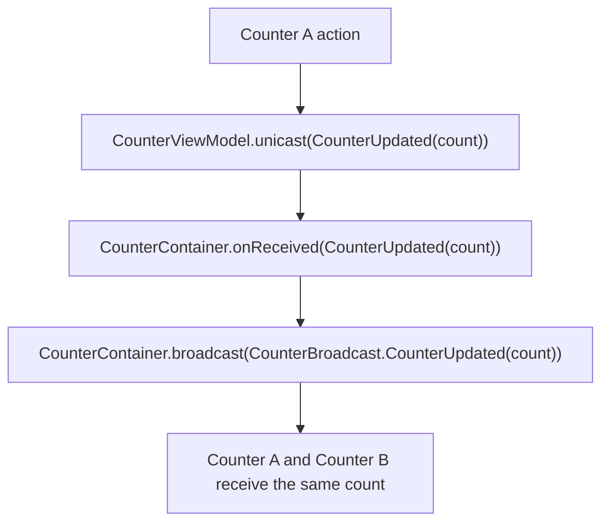

# Unicast

Unicast is PulseMVI's mechanism for sending a typed message from a `PulseViewModel` up to its parent `PulseContainer`.

Use it when a child ViewModel owns the immediate user action, but the parent Container needs to coordinate a follow-up such as broadcasting the result to sibling ViewModels.

## Defining a Unicast

Implement `PulseUnicast` with a sealed interface or sealed class. The same Unicast type is shared by the Container and every ViewModel registered in that Container, so a ViewModel cannot emit a Unicast type that the Container does not understand.

```kotlin
sealed interface CounterUnicast : PulseUnicast {
    data class CounterUpdated(val count: Int) : CounterUnicast
}
```

```kotlin
class CounterViewModel : PulseViewModel<
    CounterState,
    CounterAction,
    CounterEvent,
    CounterBroadcast,
    CounterUnicast,
>(initialUiState = CounterState())
```

```kotlin
class CounterContainer(
    viewModels: List<PulseViewModel<*, *, *, CounterBroadcast, CounterUnicast>>,
) : PulseContainer<CounterBroadcast, CounterUnicast>(viewModels = viewModels)
```

## Sending a Unicast

Call `unicast()` from inside a ViewModel. `PulseContainer` collects each registered ViewModel's `unicast` flow internally.

```kotlin
override fun onAction(uiAction: CounterAction) {
    when (uiAction) {
        CounterAction.Increment -> {
            repository.increment()
            unicast(CounterUnicast.CounterUpdated(repository.count.value))
        }
        CounterAction.Decrement -> {
            repository.decrement()
            unicast(CounterUnicast.CounterUpdated(repository.count.value))
        }
        CounterAction.Reset -> {
            repository.reset()
            unicast(CounterUnicast.CounterUpdated(repository.count.value))
        }
    }
}
```

## Receiving a Unicast

Override `onReceived()` in the Container. In the example below, the Container converts a ViewModel-to-Container Unicast into a Container-to-ViewModels Broadcast.

```kotlin
override fun onReceived(unicast: CounterUnicast) {
    when (unicast) {
        is CounterUnicast.CounterUpdated ->
            broadcast(CounterBroadcast.CounterUpdated(unicast.count))
    }
}
```

## Unicast vs Broadcast vs Event

| | Unicast | Broadcast | Event |
|---|---|---|---|
| Direction | ViewModel -> Container | Container -> all ViewModels | ViewModel -> UI |
| Cardinality | Many-to-one | One-to-many | One-to-one |
| Purpose | Parent coordination after a child action | Cross-ViewModel notification | One-time UI side effects |
| Type parameter | `PulseUnicast` | `PulseBroadcast` | `PulseEvent` |

## Example: Sharing Counter Updates

Two counter ViewModels can keep separate local repositories while sharing updates through their parent Container:

```kotlin
sealed class CounterBroadcast : PulseBroadcast {
    data class CounterUpdated(val count: Int) : CounterBroadcast()
}

sealed interface CounterUnicast : PulseUnicast {
    data class CounterUpdated(val count: Int) : CounterUnicast
}
```

```kotlin
class CounterContainer(
    viewModels: List<PulseViewModel<*, *, *, CounterBroadcast, CounterUnicast>>,
) : PulseContainer<CounterBroadcast, CounterUnicast>(viewModels = viewModels) {
    override fun onReceived(unicast: CounterUnicast) {
        when (unicast) {
            is CounterUnicast.CounterUpdated ->
                broadcast(CounterBroadcast.CounterUpdated(unicast.count))
        }
    }
}
```

```kotlin
class CounterViewModel(
    private val repository: CounterRepository,
) : PulseViewModel<CounterState, CounterAction, CounterEvent, CounterBroadcast, CounterUnicast>(
    initialUiState = CounterState(),
) {
    override fun onAction(uiAction: CounterAction) {
        when (uiAction) {
            CounterAction.Increment -> {
                repository.increment()
                unicast(CounterUnicast.CounterUpdated(repository.count.value))
            }
            CounterAction.Decrement -> {
                repository.decrement()
                unicast(CounterUnicast.CounterUpdated(repository.count.value))
            }
            CounterAction.Reset -> {
                repository.reset()
                unicast(CounterUnicast.CounterUpdated(repository.count.value))
            }
        }
    }

    override fun onReceive(broadcast: CounterBroadcast) {
        when (broadcast) {
            is CounterBroadcast.CounterUpdated -> repository.set(broadcast.count)
        }
    }
}
```

### Data flow


