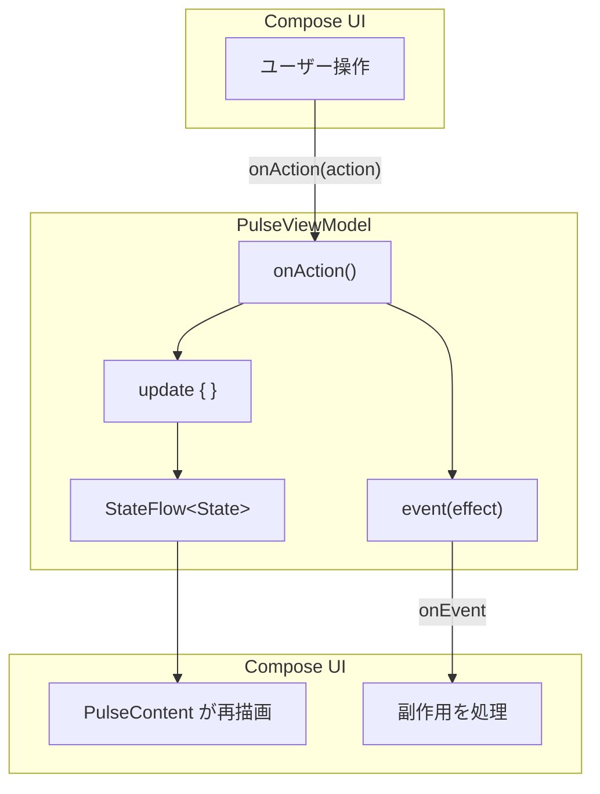
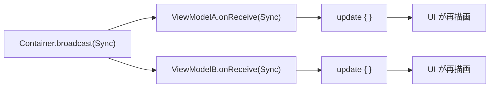
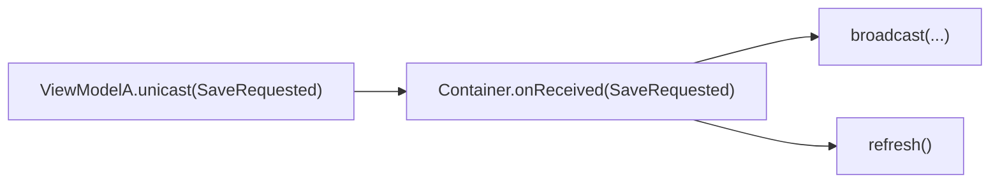
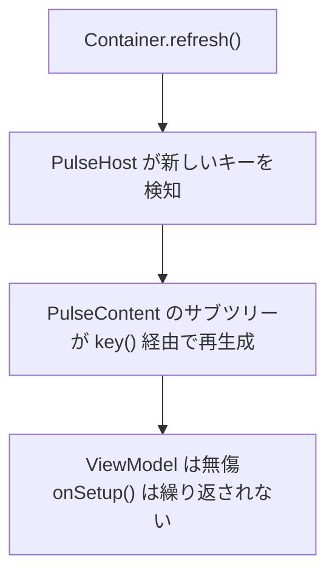
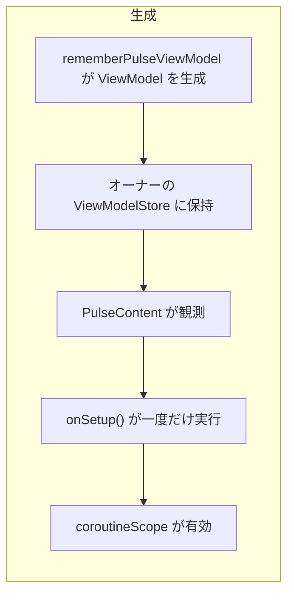
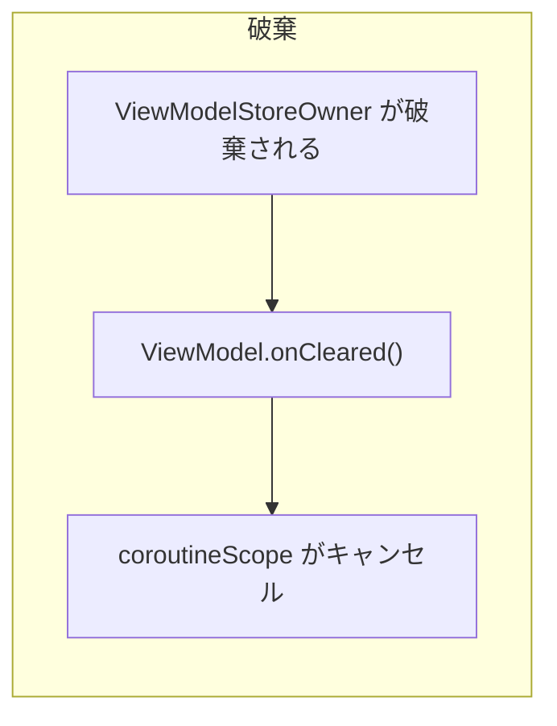

# アーキテクチャ

PulseMVI は MVI（Model-View-Intent）パターンに従います。そこに **Broadcast**、**Unicast**、**View Refresh** の 3 つの調整プリミティブを加えています。

## データフロー

## Broadcast のフロー

複数の ViewModel が同じ出来事に反応する必要があるときは `PulseContainer.broadcast()` を使います。

## Unicast のフロー

子の ViewModel が親の Container に知らせる必要があるときは `PulseViewModel.unicast()` を使います。

## View Refresh のフロー

`Container.refresh()` は Compose のビューツリーを強制的に再構築します。ViewModel の状態は**保持**されます。Composable だけが作り直されます。

## 各コンポーネントの責務

| コンポーネント | 責務 |
|---|---|
| `PulseState` | UI データの不変スナップショット |
| `PulseAction` | ユーザーの意図 — ユーザーが何をしたいか |
| `PulseEvent` | 一度きりの副作用 — ナビゲーション、ダイアログ、スナックバー |
| `PulseBroadcast` | Container から ViewModel 群への横断的な通知 |
| `PulseUnicast` | ViewModel から親への通知 |
| `PulseViewModel` | 状態を所有し、Action と Broadcast を処理し、Unicast を発行できる |
| `PulseContainer` | ViewModel 群を調整し、Broadcast・Unicast 処理・Refresh を提供する |
| `PulseHost` | Container のキーを伝播する Compose ラッパー |
| `PulseContent` | ViewModel を観測する Compose ラッパー |

## ライフサイクル

::: tip
`onSetup()` は、`PulseContent` が ViewModel を最初に観測したときに一度だけ実行されます。ViewModel は `ViewModelStoreOwner` が生きている間ずっと有効です。コンポジションの再起動でも `refresh()` でも、セットアップは繰り返されません。

どのオーナーかによって、ViewModel のライフタイムが決まります。ホストのオーナー配下で生成すれば、画面全体の間生き続けます。Navigation 3 の destination の中で生成すれば、そのバックスタックエントリにスコープされます。このとき `NavDisplay` のデコレータには `rememberPulseNavEntryDecorators()` を渡します。別の destination で覆われても、ViewModel は保持されます。ルートが pop されるとキャンセルされます。デモはすべての destination をこの方法で構築しています。
:::

