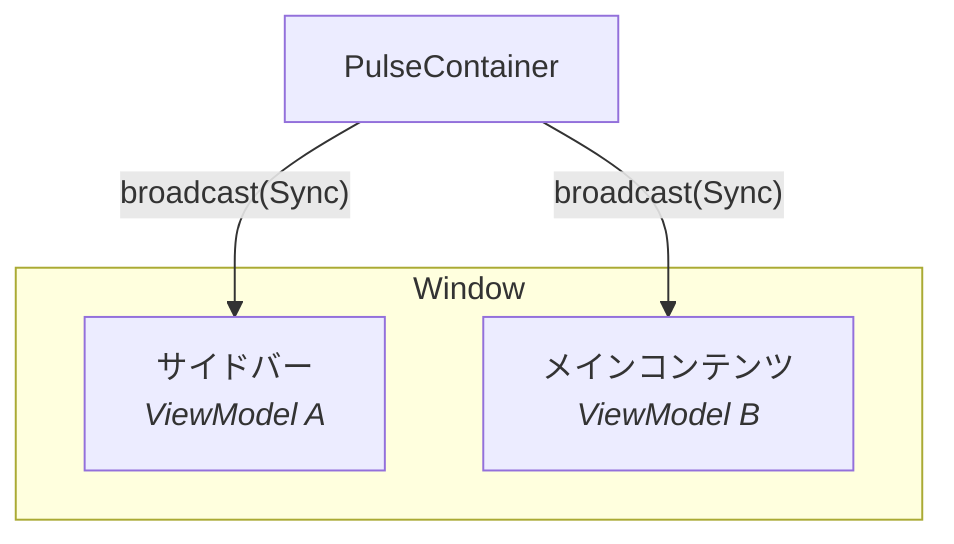

# PulseMVI とは

PulseMVI は **Compose Desktop** 向けの軽量な MVI（Model-View-Intent）ライブラリです。標準的な MVI パターンに、複数の Composable からなるレイアウトを調整するための 3 つの機能を加えています。

- **Broadcast** — Container から登録済みのすべての ViewModel へ、型付きメッセージを一斉に届ける
- **Unicast** — 子の ViewModel から親の Container へ、型付きメッセージを送る
- **View Refresh** — ViewModel の状態を失わずに、Compose のビューツリー全体をオンデマンドで再構築する

## なぜ PulseMVI か

Compose アプリはたいてい、それぞれ独自の状態を持つ独立した Composable のセクションを複数含みます。PulseMVI は、それらを密結合させずに調整できるようにします。次の図では、`PulseContainer` が両方の ViewModel の上に位置しています。`container.broadcast(MyBroadcast.Sync)` を呼ぶと、ViewModel A と ViewModel B の両方がメッセージを受け取ります。それぞれは独立して反応できます。



## インストール

### リポジトリ

`settings.gradle.kts` に JitPack を追加します。

```kotlin
// settings.gradle.kts
dependencyResolutionManagement {
    repositories {
        maven { url = uri("https://jitpack.io") }
    }
}
```

### 依存

`build.gradle.kts` に依存を追加します。`<version>` は [GitHub Releases](https://github.com/kaleidot725/PulseMVI/releases) の最新タグに置き換えてください。`pulsemvi` 単体では、ViewModel のライフタイムは利用側に委ねられます（[ViewModel](/ja/guide/viewmodel) を参照）。バックスタックエントリにスコープしたい場合は、`pulsemvi-navigation3` を追加します（[Navigation 3](/ja/guide/navigation3) を参照）。

```kotlin
// build.gradle.kts
dependencies {
    implementation("com.github.kaleidot725.PulseMVI:pulsemvi:<version>")

    // 任意: オーナーに紐づくライフタイムと Navigation 3 バックスタックへのスコープ
    implementation("com.github.kaleidot725.PulseMVI:pulsemvi-navigation3:<version>")
}
```

## アーティファクト

| アーティファクト | 内容 |
|---|---|
| `pulsemvi` | `PulseState`、`PulseAction`、`PulseEvent`、`PulseBroadcast`、`PulseUnicast`、`PulseViewModel`、`PulseContainer`、`PulseHost`、`PulseContent` |
| `pulsemvi-navigation3` | `rememberPulseViewModel`、`rememberPulseContainer`、`rememberPulseNavEntryDecorators` |

## 動作要件

| 要件 | バージョン |
|---|---|
| Java | 17 以上 |
| Kotlin | 2.0 以上 |
| Compose Multiplatform | 1.6 以上 |

## 次のステップ

- [はじめかた](/ja/guide/getting-started) — 最初のカウンターアプリを作る
- [アーキテクチャ](/ja/guide/architecture) — 各要素がどう組み合わさるかを理解する
- [Navigation 3](/ja/guide/navigation3) — ViewModel をバックスタックエントリにスコープする
- [Unicast](/ja/guide/unicast) — 子の ViewModel から Container へメッセージを送る
