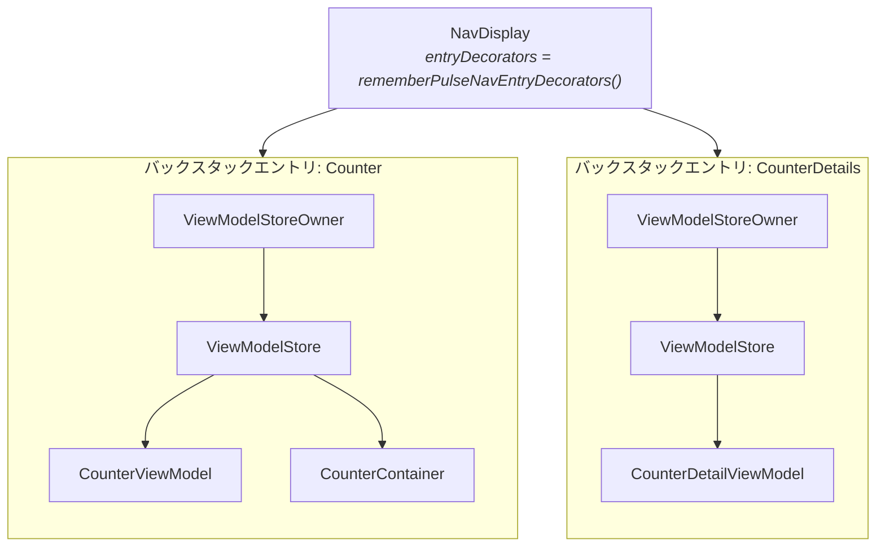

# Navigation 3

`pulsemvi-navigation3` は、`PulseViewModel` のライフタイムを Navigation 3 のバックスタックエントリに結びつける任意のアーティファクトです。コアのアーティファクトはライフタイムについて何も決めていません。`PulseViewModel` は `androidx.lifecycle.ViewModel` を継承しているので、インスタンスを保持している `ViewModelStore` がどれかによって寿命が決まります。このアーティファクトが提供するのは、そのストア（バックスタックエントリごとに 1 つ）と、ViewModel をそこに入れる Composable です。組み込みの手順は [はじめかた 手順 5](/ja/guide/getting-started#_5-viewmodel-を-navigation-3-の-destination-にスコープする) にあり、このページではその手順が何をしているかを解説します。

## アーティファクトが追加するもの

Composable が 3 つ、それだけです。コアのアーティファクトは Navigation 3 や lifecycle の Compose 依存から切り離されたままです。

| Composable | 役割 |
|---|---|
| `rememberPulseViewModel` | スコープにあるオーナーの `ViewModelStore` に `PulseViewModel` を生成する。既にあればそれを返す |
| `rememberPulseContainer` | 同じことを `PulseContainer` に対して行う |
| `rememberPulseNavEntryDecorators` | `NavDisplay` の各エントリをオーナーにするための `NavEntryDecorator` のリスト |

## オーナーはどう決まるか

`rememberPulseViewModel` は `LocalViewModelStoreOwner.current` を読み、そのオーナーの `ViewModelStore` にキー付きでインスタンスを保持します。自分でオーナーを作ることはないので、呼び出し箇所でスコープにあるオーナーが寿命を決めます。素の Compose Desktop の `Window` の下ではオーナーはウィンドウで、ViewModel は画面と同じ長さだけ生きます。`rememberPulseNavEntryDecorators()` で装飾された `NavDisplay` の下では、バックスタックの各エントリが独自のオーナーを持ち、destination の中で生成された ViewModel はそのエントリのストアに入ります。 ここから導かれるのは、ルートに属させたいものを `NavDisplay` より上で生成してはいけない、ということです。destination の外で生成した ViewModel はウィンドウのストアに入り、すべてのルートより長生きします。



## なぜデコレータが 2 つ必要か

`NavDisplay` は `NavEntryDecorator` のリストを受け取り、既定値は saveable state holder のみです。これが `rememberSaveable` の状態をバックスタックをまたいで保持しています。ViewModel をスコープするには `lifecycle-viewmodel-navigation3` の `rememberViewModelStoreNavEntryDecorator()` という 2 つ目のデコレータが要りますが、それだけを渡すと saveable state が黙って失われます。`rememberPulseNavEntryDecorators()` は両方を `NavDisplay` が期待する順で返します。このアーティファクトの存在意義の一つは、この間違いを起こしにくくすることです。

## バックスタック上のライフタイム

ストアがエントリに属しているため、ViewModel はコンポジションではなくルートに従います。別の destination でルートが覆われると Composable は消えますがエントリは消えないので、インスタンスも実行中のコルーチンも無傷です。戻ってくれば同じインスタンスが見つかり、`PulseContent` は `onSetup()` を繰り返しません。ルートが pop されるとエントリのストアが破棄され、中身すべての `onCleared()` が呼ばれます。

| ルート | ViewModel |
|---|---|
| push された | 生成され、`PulseContent` が `onSetup()` を一度実行する |
| 別の destination で覆われた | 状態もコルーチンも保持される |
| 戻ってきた | 同じインスタンス。`onSetup()` は繰り返されない |
| pop された | エントリの `ViewModelStore` が破棄され、`onCleared()` がスコープをキャンセルして Container を close する |
| オーナーが生きたままコンポジションが再起動した | 再利用され、状態は維持される |

## キー

キーの既定値は ViewModel の完全修飾クラス名で、キーはグローバルではなくオーナー単位で一意です。同じオーナーの下に同じ型のインスタンスを 2 つ置くと衝突するので、明示的なキーを与えてください。デモは 4 つのエリアがすべて同じクラスなので、4 つすべてでこれを行っています。

```kotlin
val left = rememberPulseViewModel(key = "left") { CounterViewModel(leftRepository) }
val right = rememberPulseViewModel(key = "right") { CounterViewModel(rightRepository) }
```

## Navigation 3 を使わない場合

このアーティファクトを使う必要はありません。`PulseViewModel` は `androidx.lifecycle.ViewModel` を継承しているので、`viewModel()` や `koinViewModel()` でも同じように生成でき、`PulseContent` はどう作られたかに関係なく `onSetup()` を実行します。変わるのは後始末の方です。`close()` は `onCleared()` から呼ばれ、それを呼ぶのは `ViewModelStore` だけです。[ライフサイクルを自前で扱う](/ja/guide/viewmodel#ライフサイクルを自前で扱う) を参照してください。

## 次のステップ

- [はじめかた](/ja/guide/getting-started#_5-viewmodel-を-navigation-3-の-destination-にスコープする) — 組み込みの手順
- [Navigation 3 API](/ja/api/navigation3) — 完全なシグネチャとオーナー解決のルール
- [ViewModel](/ja/guide/viewmodel) — ライフサイクルフックと状態更新
