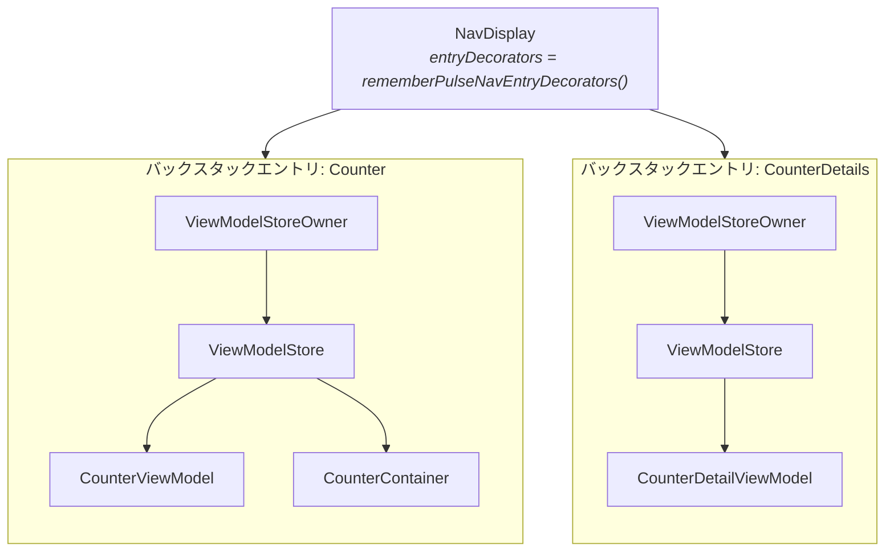

# Navigation 3

`pulsemvi-navigation3` は任意のアーティファクトです。`PulseViewModel` のライフタイムを、Navigation 3 のバックスタックエントリに結びつけます。コアのアーティファクトはライフタイムについて何も決めていません。`PulseViewModel` は `androidx.lifecycle.ViewModel` を継承しています。そのため、インスタンスを保持している `ViewModelStore` によって寿命が決まります。このアーティファクトが提供するのは 2 つです。バックスタックエントリごとのストアと、ViewModel をそこに入れる Composable です。組み込みの手順は [はじめかた 手順 5](/ja/guide/getting-started#_5-viewmodel-を-navigation-3-の-destination-にスコープする) にあります。このページでは、その手順が何をしているかを解説します。

## アーティファクトが追加するもの

Composable が 3 つ、それだけです。コアのアーティファクトは Navigation 3 や lifecycle の Compose 依存から切り離されたままです。

| Composable | 役割 |
|---|---|
| `rememberPulseViewModel` | スコープにあるオーナーの `ViewModelStore` に `PulseViewModel` を生成する。既にあればそれを返す |
| `rememberPulseContainer` | 同じことを `PulseContainer` に対して行う |
| `rememberPulseNavEntryDecorators` | `NavDisplay` の各エントリをオーナーにするための `NavEntryDecorator` のリスト |

## オーナーはどう決まるか

`rememberPulseViewModel` は `LocalViewModelStoreOwner.current` を読みます。そのオーナーの `ViewModelStore` に、キー付きでインスタンスを保持します。自分でオーナーを作ることはありません。そのため、呼び出し箇所でスコープにあるオーナーが寿命を決めます。素の Compose Desktop の `Window` の下では、オーナーはウィンドウです。ViewModel は画面と同じ長さだけ生きます。`rememberPulseNavEntryDecorators()` で装飾された `NavDisplay` の下では、バックスタックの各エントリが独自のオーナーを持ちます。destination の中で生成された ViewModel は、そのエントリのストアに入ります。したがって、ルートに属させたいものを `NavDisplay` より上で生成してはいけません。destination の外で生成した ViewModel はウィンドウのストアに入ります。すべてのルートより長生きします。



## なぜデコレータが 2 つ必要か

`NavDisplay` は `NavEntryDecorator` のリストを受け取ります。既定値は saveable state holder のみです。これが `rememberSaveable` の状態を、バックスタックをまたいで保持しています。ViewModel をスコープするには、2 つ目のデコレータが要ります。`lifecycle-viewmodel-navigation3` の `rememberViewModelStoreNavEntryDecorator()` です。ただし、それだけを渡すと saveable state が黙って失われます。`rememberPulseNavEntryDecorators()` は両方を、`NavDisplay` が期待する順で返します。この間違いを起こしにくくすることが、このアーティファクトの存在意義の 1 つです。

## バックスタック上のライフタイム

ストアはエントリに属しています。そのため、ViewModel はコンポジションではなくルートに従います。別の destination でルートが覆われると、Composable は消えます。しかし、エントリは消えません。インスタンスも実行中のコルーチンも無傷です。戻ってくれば、同じインスタンスが見つかります。`PulseContent` は `onSetup()` を繰り返しません。ルートが pop されると、エントリのストアが破棄されます。中身すべての `onCleared()` が呼ばれます。

| ルート | ViewModel |
|---|---|
| push された | 生成され、`PulseContent` が `onSetup()` を一度実行する |
| 別の destination で覆われた | 状態もコルーチンも保持される |
| 戻ってきた | 同じインスタンス。`onSetup()` は繰り返されない |
| pop された | エントリの `ViewModelStore` が破棄され、`onCleared()` がスコープをキャンセルして Container を close する |
| オーナーが生きたままコンポジションが再起動した | 再利用され、状態は維持される |

## キー

キーの既定値は ViewModel の完全修飾クラス名です。キーはグローバルではなく、オーナー単位で一意です。同じオーナーの下に同じ型のインスタンスを 2 つ置くと衝突します。明示的なキーを与えてください。デモの 4 つのエリアはすべて同じクラスです。そのため、4 つすべてで明示的なキーを与えています。

```kotlin
val left = rememberPulseViewModel(key = "left") { CounterViewModel(leftRepository) }
val right = rememberPulseViewModel(key = "right") { CounterViewModel(rightRepository) }
```

## Navigation 3 を使わない場合

このアーティファクトを使う必要はありません。`PulseViewModel` は `androidx.lifecycle.ViewModel` を継承しています。そのため、`viewModel()` や `koinViewModel()` でも同じように生成できます。`PulseContent` は、どう作られたかに関係なく `onSetup()` を実行します。変わるのは後始末の方です。`close()` は `onCleared()` から呼ばれます。それを呼ぶのは `ViewModelStore` だけです。[ライフサイクルを自前で扱う](/ja/guide/viewmodel#ライフサイクルを自前で扱う) を参照してください。

## 次のステップ

- [はじめかた](/ja/guide/getting-started#_5-viewmodel-を-navigation-3-の-destination-にスコープする) — 組み込みの手順
- [Navigation 3 API](/ja/api/navigation3) — 完全なシグネチャとオーナー解決のルール
- [ViewModel](/ja/guide/viewmodel) — ライフサイクルフックと状態更新
