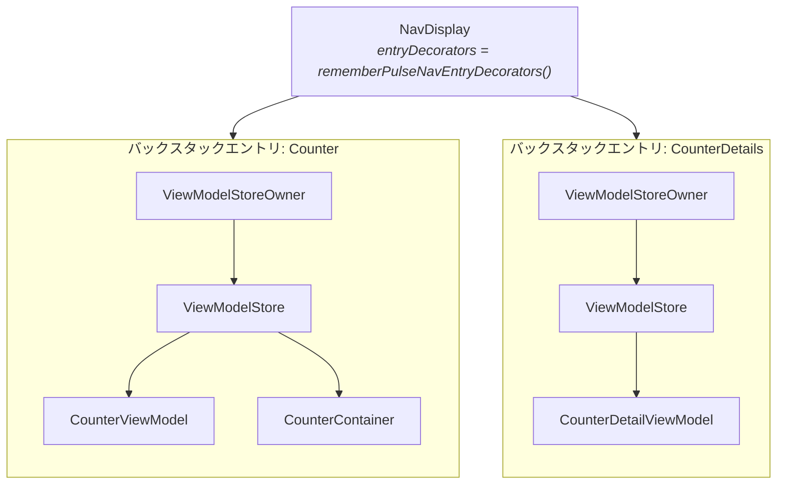

# Navigation 3

`pulsemvi-navigation3` は任意のアーティファクトです。`PulseViewModel` の寿命を、Navigation 3 のバックスタックエントリに結びつけます。

コアのアーティファクトは寿命について何も決めていません。`PulseViewModel` は `androidx.lifecycle.ViewModel` なので、それを保持している `ViewModelStore` が寿命を決めます。このアーティファクトが提供するのは、バックスタックエントリごとのストアと、ViewModel をそこに入れる Composable です。

組み込みの手順は [はじめかた 手順 5](/ja/guide/getting-started#_5-viewmodel-を-navigation-3-の-destination-にスコープする) にあります。このページでは、その手順が何をしているかを解説します。

## アーティファクトが追加するもの

Composable が 3 つ、それだけです。コアは Navigation 3 や lifecycle-compose に依存しません。

| Composable | 役割 |
|---|---|
| `rememberPulseViewModel` | スコープにあるオーナーの `ViewModelStore` に `PulseViewModel` を生成する。既にあればそれを返す |
| `rememberPulseContainer` | 同じことを `PulseContainer` に対して行う |
| `rememberPulseNavEntryDecorators` | `NavDisplay` の各エントリをオーナーにするための `NavEntryDecorator` のリスト |

## オーナーはどう決まるか

`rememberPulseViewModel` は `LocalViewModelStoreOwner.current` を読み、そのオーナーの `ViewModelStore` にインスタンスを保持します。自分でオーナーを作ることはありません。呼び出した場所でスコープにあるオーナーが、そのまま寿命を決めます。

どこで呼ぶかで、オーナーは変わります。

- **`Window` の直下** — オーナーはウィンドウです。ViewModel は画面と同じ長さだけ生きます
- **`NavDisplay` の destination の中** — `rememberPulseNavEntryDecorators()` を渡した `NavDisplay` では、バックスタックの各エントリが独自のオーナーを持ちます。ViewModel はそのエントリのストアに入ります

したがって、ルートに属させたいものは `NavDisplay` より上で生成してはいけません。destination の外で生成した ViewModel はウィンドウのストアに入り、すべてのルートより長生きします。



## なぜデコレータが 2 つ必要か

`NavDisplay` の `entryDecorators` の既定値は、saveable state holder のデコレータ 1 つだけです。これが `rememberSaveable` の状態をバックスタックをまたいで保持しています。

ViewModel をエントリにスコープするには、もう 1 つデコレータが要ります。`lifecycle-viewmodel-navigation3` の `rememberViewModelStoreNavEntryDecorator()` です。ただし、こちらだけを渡すと既定値が置き換わり、saveable state が黙って失われます。

`rememberPulseNavEntryDecorators()` は両方を、`NavDisplay` が期待する順で返します。この間違いを起こしにくくすることが、このアーティファクトの存在意義の 1 つです。

## バックスタック上の寿命

ストアはエントリに属しているので、ViewModel はコンポジションではなくルートに従います。

| ルートの状態 | ViewModel |
|---|---|
| push された | 生成され、`PulseContent` が `onSetup()` を一度実行する |
| 別の destination で覆われた | Composable は消えるがエントリは残る。状態も実行中のコルーチンも保持される |
| 戻ってきた | 同じインスタンスが見つかる。`onSetup()` は繰り返されない |
| pop された | エントリの `ViewModelStore` が破棄され、`onCleared()` がスコープをキャンセルして Container を close する |
| オーナーが生きたままコンポジションが再起動した | 再利用され、状態は維持される |

## キー

キーの既定値は ViewModel の完全修飾クラス名です。キーはオーナー単位で一意なので、同じオーナーの下に同じ型を 2 つ置くと衝突します。明示的なキーを与えてください。デモの 4 つのエリアは同じクラスなので、4 つすべてにキーを付けています。

```kotlin
val left = rememberPulseViewModel(key = "left") { CounterViewModel(leftRepository) }
val right = rememberPulseViewModel(key = "right") { CounterViewModel(rightRepository) }
```

## Navigation 3 を使わない場合

このアーティファクトは必須ではありません。`PulseViewModel` は `androidx.lifecycle.ViewModel` なので、`viewModel()` や `koinViewModel()` でも生成できます。`PulseContent` はどう作られたかに関係なく `onSetup()` を実行します。

変わるのは後始末です。`close()` を呼ぶのは `onCleared()` で、それを呼ぶのは `ViewModelStore` だけです。ストアなしで持つ場合は [ライフサイクルを自前で扱う](/ja/guide/viewmodel#ライフサイクルを自前で扱う) を参照してください。

## 次のステップ

- [はじめかた](/ja/guide/getting-started#_5-viewmodel-を-navigation-3-の-destination-にスコープする) — 組み込みの手順
- [Navigation 3 API](/ja/api/navigation3) — 完全なシグネチャとオーナー解決のルール
- [ViewModel](/ja/guide/viewmodel) — ライフサイクルフックと状態更新
