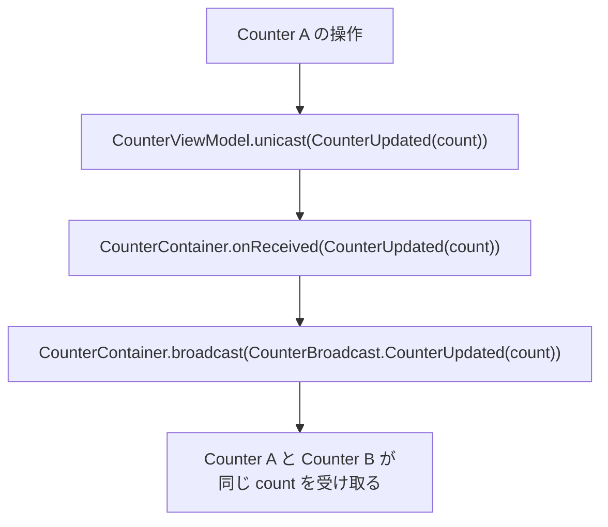

# Unicast

Unicast は PulseMVI の仕組みの 1 つです。`PulseViewModel` から親の `PulseContainer` へ、型付きメッセージを送ります。

使う場面は、操作の処理と後続の調整が分かれているときです。直近のユーザー操作は子の ViewModel が担当します。その結果を兄弟の ViewModel に Broadcast するといった調整は、親の Container が行います。

## Unicast を定義する

sealed interface または sealed class で `PulseUnicast` を実装します。Unicast の型は Container と共有されます。その Container に登録されるすべての ViewModel も、同じ型を使います。このジェネリクスの組み合わせにより、Container が理解できない Unicast 型を ViewModel が発行することはできません。

```kotlin
sealed interface CounterUnicast : PulseUnicast {
    data class CounterUpdated(val count: Int) : CounterUnicast
}
```

```kotlin
class CounterViewModel : PulseViewModel<
    CounterState,
    CounterAction,
    CounterEvent,
    CounterBroadcast,
    CounterUnicast,
>(initialUiState = CounterState())
```

```kotlin
class CounterContainer(
    viewModels: List<PulseViewModel<*, *, *, CounterBroadcast, CounterUnicast>>,
) : PulseContainer<CounterBroadcast, CounterUnicast>(viewModels = viewModels)
```

## Unicast を送る

ViewModel の中から `unicast()` を呼びます。`PulseContainer` は登録済みの各 ViewModel の `unicast` Flow を内部で収集します。

```kotlin
override fun onAction(uiAction: CounterAction) {
    when (uiAction) {
        CounterAction.Increment -> {
            repository.increment()
            unicast(CounterUnicast.CounterUpdated(repository.count.value))
        }
        CounterAction.Decrement -> {
            repository.decrement()
            unicast(CounterUnicast.CounterUpdated(repository.count.value))
        }
        CounterAction.Reset -> {
            repository.reset()
            unicast(CounterUnicast.CounterUpdated(repository.count.value))
        }
    }
}
```

## Unicast を受け取る

Container で `onReceived()` をオーバーライドします。次の例では、Container が Unicast を Broadcast に変換しています。ViewModel から受け取った Unicast を、ViewModel 群への Broadcast として送り直しています。

```kotlin
override fun onReceived(unicast: CounterUnicast) {
    when (unicast) {
        is CounterUnicast.CounterUpdated ->
            broadcast(CounterBroadcast.CounterUpdated(unicast.count))
    }
}
```

## Unicast・Broadcast・Event の違い

| | Unicast | Broadcast | Event |
|---|---|---|---|
| 方向 | ViewModel -> Container | Container -> すべての ViewModel | ViewModel -> UI |
| 多重度 | 多対 1 | 1 対多 | 1 対 1 |
| 目的 | 子の操作後に親が行う調整 | ViewModel 横断の通知 | 一度きりの UI 副作用 |
| 型パラメータ | `PulseUnicast` | `PulseBroadcast` | `PulseEvent` |

## 例: カウンターの更新を共有する

2 つのカウンター ViewModel は、それぞれ別のリポジトリを持ちます。それでも、親の Container を通じて更新を共有できます。

```kotlin
sealed class CounterBroadcast : PulseBroadcast {
    data class CounterUpdated(val count: Int) : CounterBroadcast()
}

sealed interface CounterUnicast : PulseUnicast {
    data class CounterUpdated(val count: Int) : CounterUnicast
}
```

```kotlin
class CounterContainer(
    viewModels: List<PulseViewModel<*, *, *, CounterBroadcast, CounterUnicast>>,
) : PulseContainer<CounterBroadcast, CounterUnicast>(viewModels = viewModels) {
    override fun onReceived(unicast: CounterUnicast) {
        when (unicast) {
            is CounterUnicast.CounterUpdated ->
                broadcast(CounterBroadcast.CounterUpdated(unicast.count))
        }
    }
}
```

```kotlin
class CounterViewModel(
    private val repository: CounterRepository,
) : PulseViewModel<CounterState, CounterAction, CounterEvent, CounterBroadcast, CounterUnicast>(
    initialUiState = CounterState(),
) {
    override fun onAction(uiAction: CounterAction) {
        when (uiAction) {
            CounterAction.Increment -> {
                repository.increment()
                unicast(CounterUnicast.CounterUpdated(repository.count.value))
            }
            CounterAction.Decrement -> {
                repository.decrement()
                unicast(CounterUnicast.CounterUpdated(repository.count.value))
            }
            CounterAction.Reset -> {
                repository.reset()
                unicast(CounterUnicast.CounterUpdated(repository.count.value))
            }
        }
    }

    override fun onReceive(broadcast: CounterBroadcast) {
        when (broadcast) {
            is CounterBroadcast.CounterUpdated -> repository.set(broadcast.count)
        }
    }
}
```

### データの流れ


